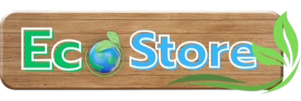

<p align="center">

</p>

<h1 align="center">
EcoStore 🌿
</h1>

<p align="center">
High-quality, eco-friendly products for a sustainable lifestyle.
</p>

<p align="center">


</p>

📝 Overview
EcoStore is a web application dedicated to making sustainable living accessible and effortless. We offer a curated selection of ethically sourced, eco-friendly products designed to be kind to our planet. Our mission is to empower consumers to make environmentally conscious choices without compromising on quality or beauty.

✨ Features
🛍️ Curated Shop: Browse a wide range of sustainable products.

✍️ Engaging Blog: Read articles on sustainable living and eco-friendly tips.

🌍 Carbon Footprint Calculator: (Future Implementation) A tool to help users understand their environmental impact.

🤝 Community Support: Connect with a community of like-minded individuals.

🚀 Tech Stack
<p align="center">


</p>

⚙️ Getting Started
Follow these instructions to get a copy of the project up and running on your local machine for development and testing purposes.

Prerequisites
You will need to have Node.js and npm installed on your machine.

```
ecostore/
├── backend/
│   └── index.js         # Backend server entry point
├── public/
│   ├── index.html       # Main HTML file
│   └── ...              # Other static assets
├── src/
│   ├── assets/          # Images and other assets
│   ├── components/      # React components
│   │   ├── AboutPage.js
│   │   ├── BlogsPage.js
│   │   ├── Carbono.js
│   │   ├── HomePage.js
│   │   ├── ShopPage.js
│   │   └── Support.js
│   ├── App.css
│   ├── App.js           # Main application component with routing
│   ├── App.test.js
│   ├── index.css
│   ├── index.js         # Entry point for the React application
│   ├── reportWebVitals.js
│   └── setupTests.js
├── .gitignore
├── package.json
└── README.md
```


Installation
1. Clone the repository:

```
git clone https://github.com/devaki01/ecostore.git
cd ecostore
```

2. Install Frontend Dependencies:

```
npm install
Install Backend Dependencies:
```

3. Install backend Dependencies: 

```
cd backend
npm install
```

4. Running the Application
   
Frontend (Client)
From the root directory, run the following command to start the React development server:

```
npm start
```

Open your browser and navigate to http://localhost:3000 to see the application.

Backend (Server)
Navigate to the backend directory and start the server:

```
cd backend
node index.js
```
The backend server will be running on http://localhost:5001.

🤝 How to Contribute
We welcome contributions from the community! If you'd like to contribute, please follow these steps:

-> Fork the repository.

-> Create a new branch for your feature or bug fix: git checkout -b feature/your-feature-name

-> Make your changes and commit them with a clear and descriptive message.

-> Push your changes to your forked repository.

-> Create a pull request to the main branch of the original repository.

-> Please make sure your code adheres to our coding standards and includes tests where applicable.

📜 License
This project is licensed under the MIT License. See the LICENSE file for more details.
